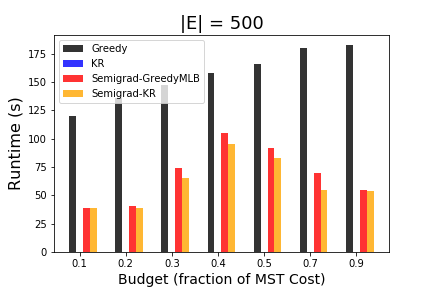
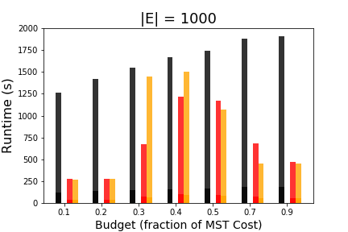

budget-pcsf-semigradient-ascent
==================
Heuristic algorithms for solving the budget-constrained prize collecting Steiner forest problem.

* **Citation Info:** Gupta, A. and Dilkina, B., 2019, November. Budget-Constrained Demand-Weighted Network Design for Resilient Infrastructure. In *2019 IEEE 31st International Conference on Tools with Artificial Intelligence (ICTAI)*. IEEE.

--------
Overview
--------
We address the problem of allocating a fixed budget towards restoring edges to maximize the satisfied travel demand between locations in a network, which we formalize as the budget-constrained prize-collecting Steiner forest problem. We prove that the satisfiable travel demand objective exhibits *restricted supermodularity over forests*, and utilize this property to design an iterative algorithm based on maximizing successive modular lower bounds for the objective that finds better solutions than a baseline greedy approach. We also propose an extremely fast heuristic for maximizing modular functions subject to knapsack and graph matroid constraints that can be used as a subroutine in the iterative algorithm, or as a standalone method that matches the greedy baseline in terms of quality but is hundreds of times faster. We evaluate the algorithms on synthetic data, and apply them to a real-world instance of retrofitting the Senegal national and regional road network against flooding.

-----
Setup
-----
**Dependencies**
* [Gurobi Optimizer](https://www.gurobi.com/products/gurobi-optimizer/)
* [gurobipy](https://www.gurobi.com/documentation/8.1/quickstart_mac/the_gurobi_python_interfac.html)
* numpy
* matplotlib

All code was written in Python 2.7.6.

**Directory Structure**
```
|____data
| |____synthetic_graphs
| | |____planar
| | | |____demands
| | | | |____G_n_edges_500_instance_0_demand_data.p
| | | | |____...
| | | |____edge_costs
| | | | |____G_n_edges_500_instance_0_cost_data.p
| | | | |____...
| | | |____edge_max_values_20
| | | | |____G_n_edges_500_instance_0_edge_values_data.p
| | | | |____...
| | | |____edge_values
| | | | |____G_n_edges_500_instance_0_edge_values_data.p
| | | | |____...
| | | |____graphs
| | | | |____G_n_edges_500_instance_0.graphml
| | | | |____...
|____LICENSE
|____notebooks
| |____generate-random-erdos-renyi-graph.ipynb
| |____generate-random-planar-graph.ipynb
|____output
| |____synthetic_graphs
| | |____er
| | |____planar
|____README.md
|____scripts
| |____budgetpcsf.py
| |____computemaxval.py
| |____run_experiments.py
```

**How To Run**

1. The `.ipynb` notebooks in `notebooks/` generate synthetic instances based on either Erdos-Renyi graphs or planar graphs. They populate the `data/` folder with graphs, random edge costs and demand between pairs of nodes, as well as the demand between endpoints of each edge (edge values), which are used by the optimization algorithms.
2. `scripts/computemaxval.py` estimates the maximum value of each edge by sampling 20 random spanning trees and evaluating the reduction in satisfiable travel demand when the edge is removed. Results are written to `data/`.
3. `scripts/budgetpcsf.py` implements:

    a. greedy

    b. knapsack-repair

    c. semigradient ascent (using either greedy or knapsack-repair as subroutines)

    It also contains methods called by `scripts/computemaxval.py` and helper functions.
4. `scripts/run_experiments.py` shows how we set up all experiments in our ICTAI 2019 paper.

-------
Results
-------
### Random Planar Graphs
**Relative Solution Quality**


**Runtime Performance**





### Random Erdos-Renyi Graphs

**Relative Solution Quality**


**Runtime Performance**


